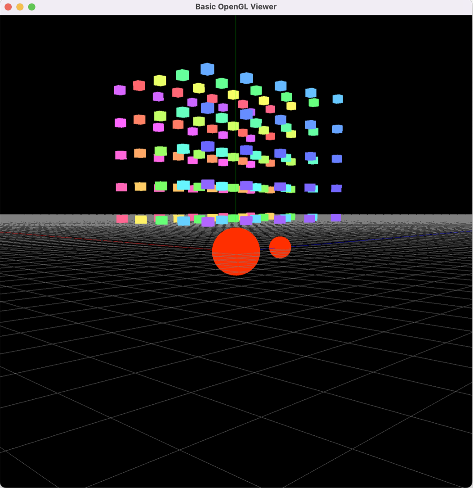

# Computer Graphics

## Requirements to setup
- Use `pip install -r requirements.txt` to install required python packages
## Class Assignments

### 1. Class Assignment 1 - Basic OpenGL Viewer

- Call basic legacy OpenGL functions to implement basic OpenGL Viewer
- You can manipulate the camera-relative position by orbiting and zooming
- Also, you can easily move the camera position with respect to the camera using right-clicked dragging.

### 2. Class Assignment 2 - OpenGL Model Viewer

<iframe width="560" height="315" src="https://www.youtube.com/embed/ArXzxCN6KR0" title="YouTube video player" frameborder="0" allow="accelerometer; autoplay; clipboard-write; encrypted-media; gyroscope; picture-in-picture" allowfullscreen></iframe>

- Implement super-fast OBJ model rendering using the parallel loader
- Use `regex` module to implement a OBJ parser

### 3. Class Assignment 3 - OpenGL BVH Viewer

<iframe width="560" height="315" src="https://www.youtube.com/embed/X9dRt1w7M1I" title="YouTube video player" frameborder="0" allow="accelerometer; autoplay; clipboard-write; encrypted-media; gyroscope; picture-in-picture" allowfullscreen></iframe>

- With the help of Class Assignment 2, implement an efficient BVH parser using the parallel loader
- Use `str` module to implement a BVH parser